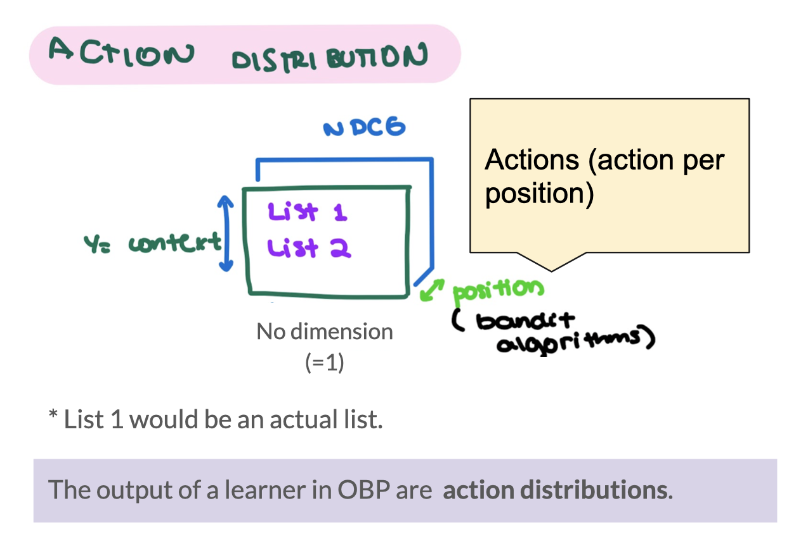

The focus is on offline experimentation  
[OBP Tutorial](https://sites.google.com/cornell.edu/recsys2021tutorial) 

**OBP PROCESS**
 
*From [OBP Project](https://github.com/st-tech/zr-obp)*

**Data Management** 
- Datasets 
- Bandit Feedback 
  1. Dictionary storing logged data 
  2. Action_context: Context vectors characterizing actions (i.e., a vector representation or an embedding of each action). 
  3. OBP Extension (Slate): Comparison of bandit feedback 

**Off-Policy Learner**  
[OBP Off-Policy Learner Notebook](https://colab.research.google.com/github/st-tech/zr-obp/blob/master/examples/quickstart/opl.ipynb) 
- Class wrapper for ML model 
  1. Example IPWLearner  
  2. Off-policy learner based on Inverse Probability Weighting and Supervised Classification. 
- Outputs  
  1. predictions  
  2. action_probabilty distributions(where len_size = 1) 

**Simulation**  
Based on online policy mainly 

**Off-Policy Estimators (OPE)** 
- Policy values (metrics) based on reward system 
- Return values within [0,1] 
- Estimates the performance of a policy based on log history 
