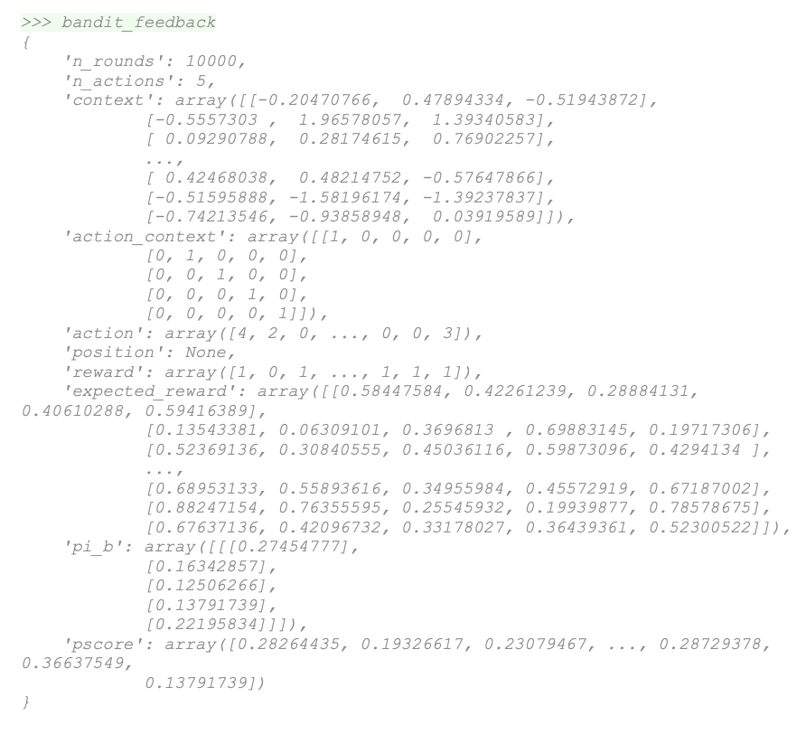
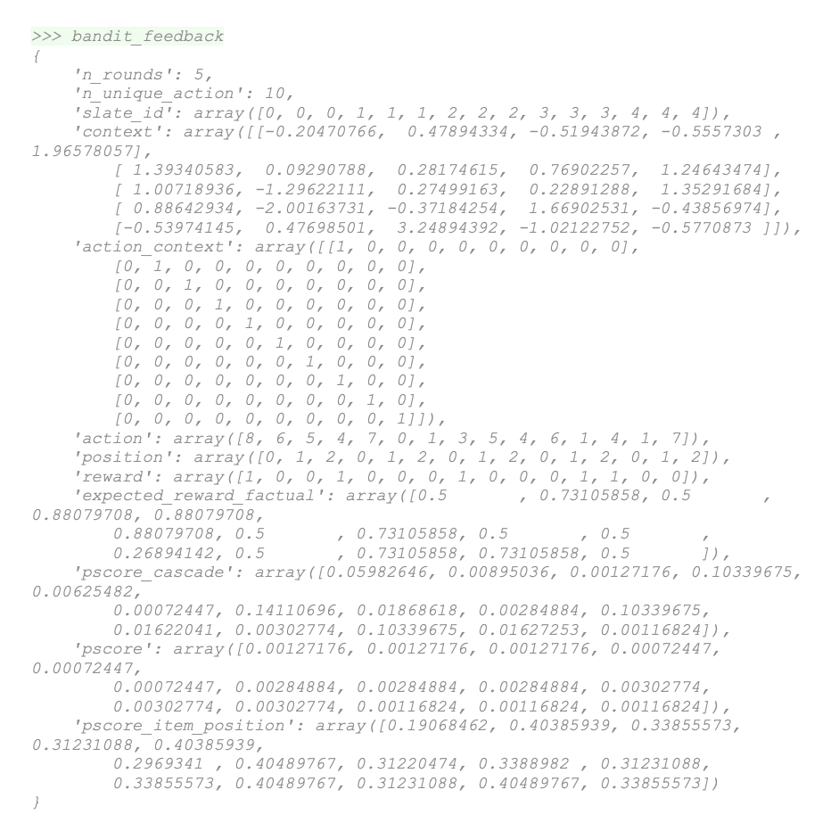

# Data Structures: OBP Bandit Feedback

### Example of Bandit Feedback
Bandit_feedback example form SyntheticBanditDataset in [synthetic.py](https://github.com/st-tech/zr-obp/blob/master/obp/dataset/synthetic.py)

### Example of Extended Slate Implementation
Bandit_feedback example form SyntheticBanditDataset in [synthetic_slate.py](https://github.com/st-tech/zr-obp/blob/master/obp/dataset/synthetic_slate.py)

