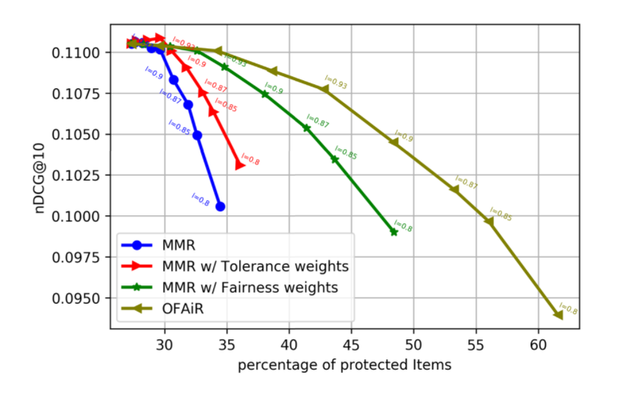
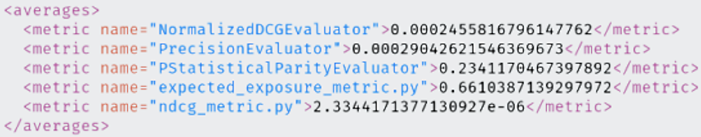
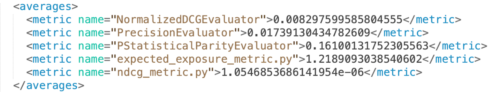
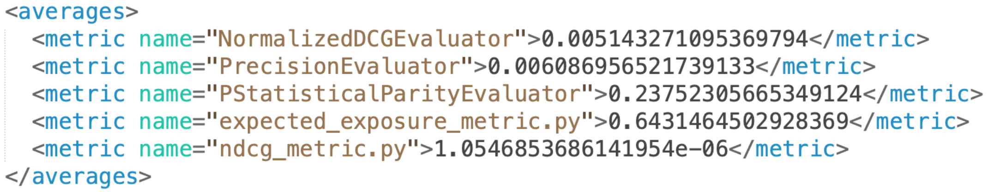

[Librec-auto: ofair_rerank.py](https://github.com/that-recsys-lab/librec-auto/blob/master/librec_auto/core/cmd/rerank/ofair_rerank.py)  

**[OFAiR_Paper](content/papers/OFAIR_Paper.pdf) Results**  

**Revised Logic Cleaning @50 with obp_rerank.py**  
OBP just gives the OFAiR metrics. OBP should give me the same items, and positions for each items (it doesn’t change).  
*SAME METRICS WITH OFAIR_RERANK.PY*

**Similar to Sonboli's OFAiR paper data cleaning @10 with ofair_rerank.py**  

**Similar to Sonboli's OFAiR paper data cleaning @50 with ofair_rerank.py**  

