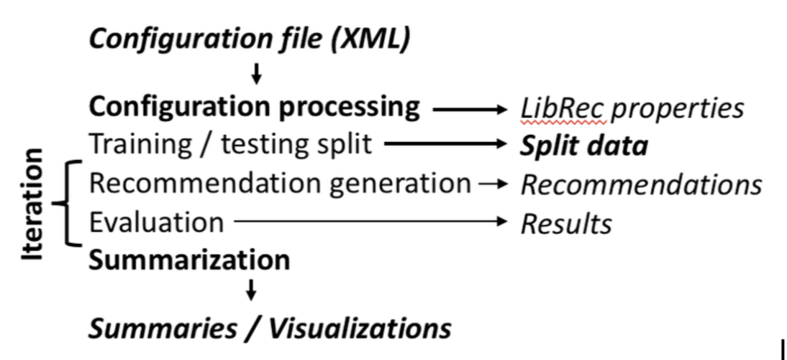
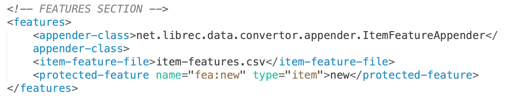
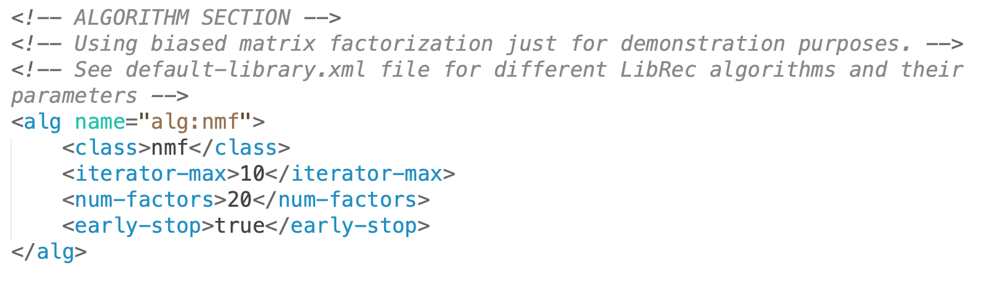
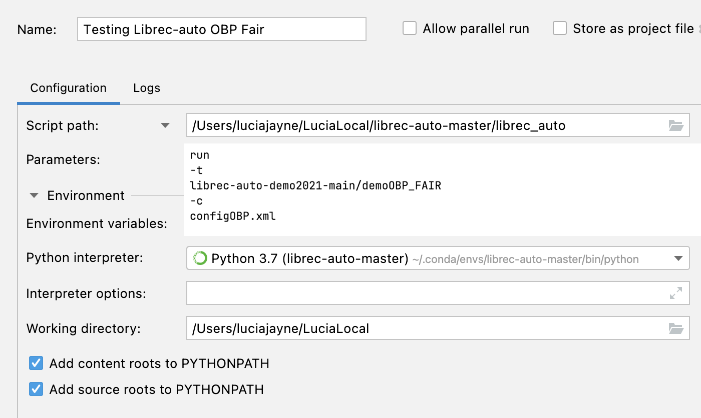
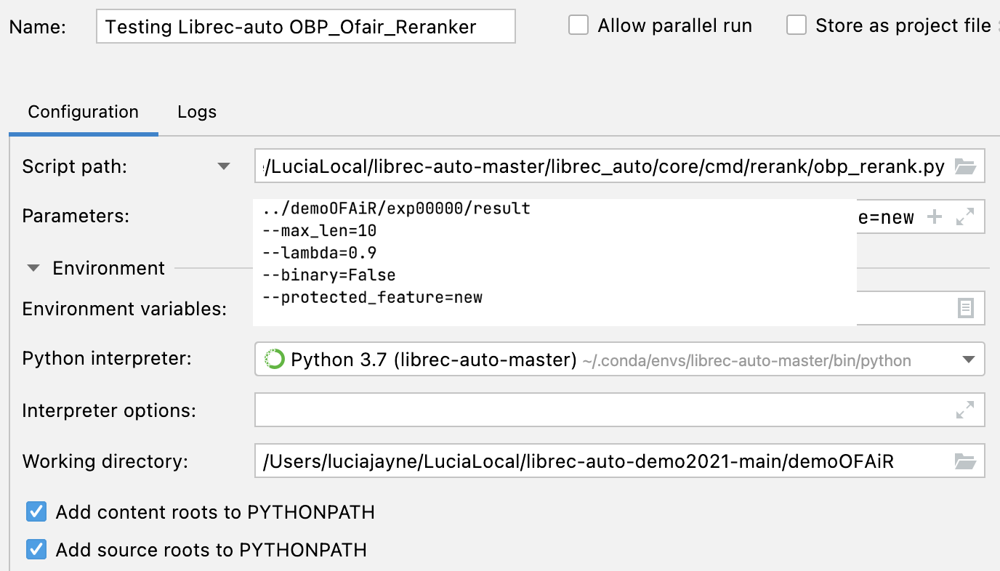

# Configurations
## Librec-auto Configuration File
LibRec Auto takes a configuration file, then splits the data, then recommendations, then evaluations.

1. Data section: Uploads the data.

2. Feature section: Enumerates the features and pin the features to the dataset.

3. Splitter section: not applicable for this project.

4. Algorithm section: Responsible for taking the features and give the recommendation list.

5. Rerank section: Necessary for SCRUF-D project.

*Other sections: metrics (measurement), post-processing (for excel, or browser).*

## PyCharm Testing Configuration Examples

### OBP Demo OFAiR Configuration

### OBP OFAiR Reranker Configuration

