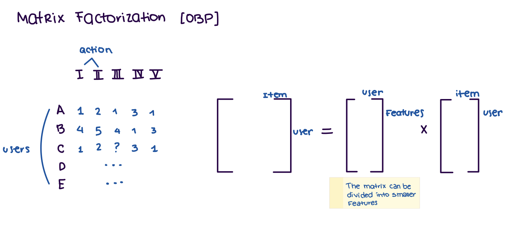
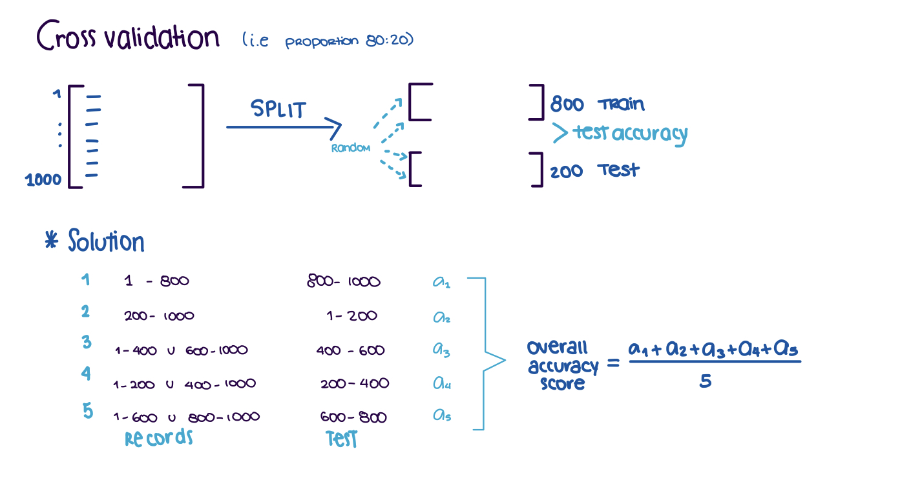

# Additional Notes

### Matrix Factorization

### Crossvalidation

### Metrics
- PSP[0,1]: cares about the item being in the list. Protected Feature/Item. PSP = -1 (all non-protected). PSP = 1 (all protected). PSP = 0 (It is equally divided 50/50).
- NDCG[-1,1]: (accumulative weight) cares about the order. The higher the NDCG, the more closely follows the test data.
- Expected Exposure: additional way of comparing the rating.
